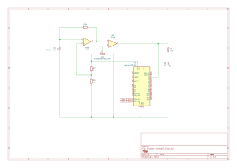

# Li-Fi (Light Fidelity) Communication System
A prototype implementation of a Li-Fi communication system that uses visible light for high-speed data transmission.
This project demonstrates data transfer between devices by utilising visible light as an alternative to traditional RF-based communication.

## Overview
With wireless communication devices becoming increasingly ubiquitous globally there is an increased possibility of RF spectrum overcrowding. Several measures are being taken to overcome this challenge including shifting to a larger electromagnetic spectrum in the Visible Light band.
With a band 1000 times larger than RF, visible light also offers increased immunity from interference making it a viable alternative. 

This project uses an array of LEDs as the transmitter and a photodiode as the receiver. The system was designed, developed and tested as part of my undergraduate Electrical and Electronic Engineering coursework at the **University of Nairobi**. 

## System Architecture
**Block Diagram:**
<p align="center">

</p>

## Components Used
### Transmitter Side:
1. 3 ultra bright 5mm white LEDs
2. 3 100 ohm resistors
3. Arduino Uno R3 development board
4. Jumper wires
5. Perfboard

### Receiver Side:
1. BPW34 PIN photodiode
2. LM358N integrated circuit
3. Arduino Uno R3 development board
4. I2C 16x2 LCD
5. 1k ohm resistor
6. 24k ohm resistor
7. 100k ohm resistor
8. 220 ohm resistor
9. 10k ohm 3296 BAOTER trimmer potentiometer
10. 3mm diffused red LED
11. 9V battery

## Setup
Follow these steps to assemble the system:
1. **Clone repository:**
   ```bash
   git clone https://github.com/zachmongare/Li-Fi-Communication-System.git
   cd Li-Fi-Communication-System
2. **Assembly:**
   - Build the transmitter circuit as shown in .
   - Build the receiver circuit as shown in .
3. **Upload the Code:**
   - Connect the transmitter Arduino Uno R3 to your PC and open the Arduino IDE.
   - Select the correct board and port and upload the code in [code/transmitter.ino](code/transmitter.ino).
   - Repeat the above steps for the receiver Arduino Uno R3 and upload the code in [code/receiver.ino](code/receiver.ino).
4. **Run the System:**
   - Connect the transmitter to your PC and open suitable serial monitor interface.
   - Power the receiver using a 9V battery or usb power source.
   - Align the photodiode and LEDs.
   - Begin data transmission from transmitter.
   - Observe the decoded message on receiver's connected display.
  
## Results
- Achieved stable transmission up to 0.5 metres under normal lighting conditions.
- Stable data rate of 200 bps.
- Successful demonstration of data transfer over visible light.

## Recommendations
- Implement higher-order modulation schemes.
- Increase transmission distance and data rate by using higher power LEDs and faster microcontrollers.
- Applying advanced filtering methods to reduce impact of ambient lighting.
